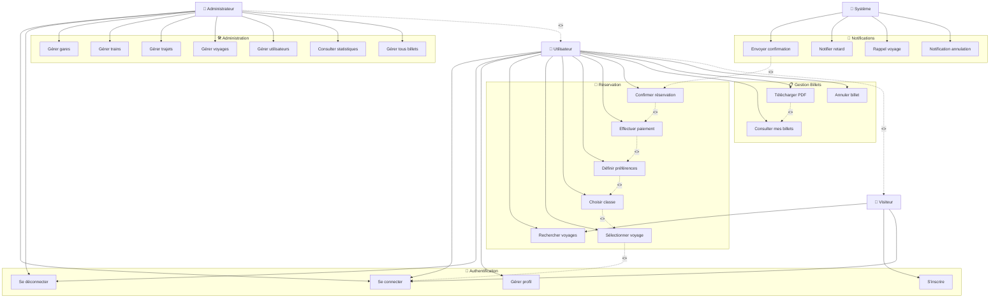
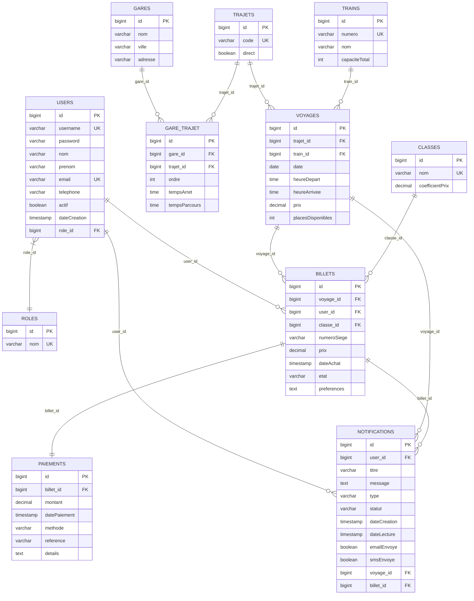
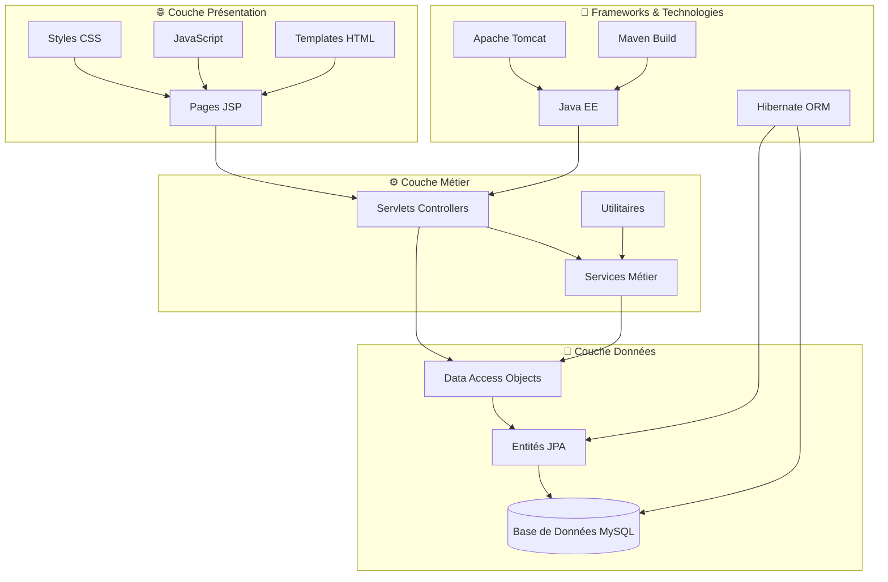
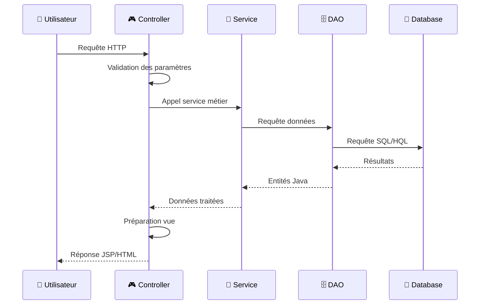

# RAPPORT TECHNIQUE - SYSTÈME DE RÉSERVATION DE BILLETS DE TRAIN

## 📋 TABLE DES MATIÈRES

1. [Introduction](#introduction)
2. [Besoins Fonctionnels](#besoins-fonctionnels)
3. [Diagramme de Cas d'Utilisation](#diagramme-de-cas-dutilisation)
4. [Diagramme de Classes](#diagramme-de-classes)
5. [Schéma de Base de Données](#schéma-de-base-de-données)
6. [Architecture Technique](#architecture-technique)
7. [Technologies Utilisées](#technologies-utilisées)

---

## 🎯 INTRODUCTION

Le **Train Ticket System** est une application web de réservation de billets de train développée en Java EE. Elle permet aux utilisateurs de rechercher des voyages, réserver des billets et gérer leurs réservations, tout en offrant aux administrateurs des outils de gestion complets.

### Objectifs du Système
- Faciliter la réservation de billets de train en ligne
- Optimiser la gestion des voyages et des ressources
- Fournir une interface intuitive pour les utilisateurs
- Offrir des outils d'administration complets

---

## 📋 BESOINS FONCTIONNELS

### 🔐 Gestion des Utilisateurs

#### RF-001 : Authentification
- **Description** : Le système doit permettre l'authentification des utilisateurs
- **Acteurs** : Utilisateur, Administrateur
- **Fonctionnalités** :
  - Connexion avec nom d'utilisateur/mot de passe
  - Déconnexion sécurisée
  - Gestion des sessions
  - Redirection selon le rôle (USER/ADMIN)

#### RF-002 : Inscription
- **Description** : Le système doit permettre l'inscription de nouveaux utilisateurs
- **Acteurs** : Visiteur
- **Fonctionnalités** :
  - Création de compte avec validation des données
  - Vérification de l'unicité (username, email)
  - Hachage sécurisé des mots de passe (BCrypt)
  - Attribution automatique du rôle USER

#### RF-003 : Gestion des Profils
- **Description** : Les utilisateurs peuvent gérer leurs informations personnelles
- **Acteurs** : Utilisateur connecté
- **Fonctionnalités** :
  - Consultation du profil
  - Modification des informations personnelles
  - Historique des réservations

### 🔍 Recherche et Réservation

#### RF-004 : Recherche de Voyages
- **Description** : Le système doit permettre la recherche de voyages disponibles
- **Acteurs** : Utilisateur, Visiteur
- **Fonctionnalités** :
  - Recherche par ville de départ/arrivée
  - Filtrage par date
  - Option trajets directs uniquement
  - Affichage des résultats avec détails (horaires, prix, places disponibles)

#### RF-005 : Sélection et Personnalisation
- **Description** : L'utilisateur peut personnaliser sa réservation
- **Acteurs** : Utilisateur connecté
- **Fonctionnalités** :
  - Sélection de la classe de voyage (Économique, Première, Business)
  - Choix des préférences (place fenêtre, etc.)
  - Calcul automatique du prix selon la classe
  - Option voyage de retour

#### RF-006 : Processus de Paiement
- **Description** : Le système doit gérer le processus de paiement sécurisé
- **Acteurs** : Utilisateur connecté
- **Fonctionnalités** :
  - Récapitulatif de la commande
  - Choix de la méthode de paiement (Carte, Virement, PayPal)
  - Validation des informations de paiement
  - Génération automatique du billet

#### RF-007 : Confirmation et Billetterie
- **Description** : Le système doit confirmer les réservations et générer les billets
- **Acteurs** : Utilisateur connecté
- **Fonctionnalités** :
  - Page de confirmation avec détails du voyage
  - Génération de billet numérique
  - Téléchargement PDF du billet
  - Envoi de confirmation par email

### 👤 Gestion des Billets Utilisateur

#### RF-008 : Mes Billets
- **Description** : Les utilisateurs peuvent consulter et gérer leurs billets
- **Acteurs** : Utilisateur connecté
- **Fonctionnalités** :
  - Liste de tous les billets achetés
  - Filtrage par statut (Actifs, Utilisés, Annulés)
  - Téléchargement PDF des billets
  - Détails complets de chaque voyage

### 🛠️ Administration

#### RF-009 : Gestion des Gares
- **Description** : Les administrateurs peuvent gérer les gares
- **Acteurs** : Administrateur
- **Fonctionnalités** :
  - Création, modification, suppression de gares
  - Gestion des informations (nom, ville, adresse)
  - Liste et recherche des gares

#### RF-010 : Gestion des Trains
- **Description** : Les administrateurs peuvent gérer la flotte de trains
- **Acteurs** : Administrateur
- **Fonctionnalités** :
  - Ajout de nouveaux trains
  - Modification des caractéristiques (numéro, nom, capacité)
  - Gestion de la disponibilité

#### RF-011 : Gestion des Trajets
- **Description** : Les administrateurs peuvent définir les trajets
- **Acteurs** : Administrateur
- **Fonctionnalités** :
  - Création de trajets entre gares
  - Définition de l'ordre des gares
  - Gestion des trajets directs/avec correspondances
  - Association des temps de parcours

#### RF-012 : Gestion des Voyages
- **Description** : Les administrateurs peuvent programmer les voyages
- **Acteurs** : Administrateur
- **Fonctionnalités** :
  - Création de voyages (trajet + train + horaires)
  - Définition des prix et places disponibles
  - Modification des horaires
  - Annulation de voyages

#### RF-013 : Gestion des Billets
- **Description** : Les administrateurs peuvent gérer tous les billets
- **Acteurs** : Administrateur
- **Fonctionnalités** :
  - Consultation de tous les billets
  - Modification du statut des billets
  - Remboursements et annulations
  - Statistiques de vente

#### RF-014 : Gestion des Utilisateurs
- **Description** : Les administrateurs peuvent gérer les comptes utilisateurs
- **Acteurs** : Administrateur
- **Fonctionnalités** :
  - Liste de tous les utilisateurs
  - Activation/désactivation de comptes
  - Modification des rôles
  - Consultation de l'historique

#### RF-015 : Statistiques et Rapports
- **Description** : Le système doit fournir des statistiques détaillées
- **Acteurs** : Administrateur
- **Fonctionnalités** :
  - Statistiques de vente par période
  - Taux d'occupation des trains
  - Revenus par trajet/classe
  - Graphiques et tableaux de bord

### 📧 Notifications

#### RF-016 : Système de Notifications
- **Description** : Le système doit notifier les utilisateurs des événements importants
- **Acteurs** : Système, Utilisateur
- **Fonctionnalités** :
  - Notifications de confirmation de réservation
  - Alertes de retard ou annulation
  - Rappels de voyage
  - Notifications de remboursement
  - Envoi par email et interface web

### 📄 Génération de Documents

#### RF-017 : Génération PDF
- **Description** : Le système doit générer des documents PDF
- **Acteurs** : Utilisateur connecté
- **Fonctionnalités** :
  - Billets de train au format PDF
  - Factures de paiement
  - Récapitulatifs de voyage
  - Mise en page professionnelle

---

## 🎭 DIAGRAMME DE CAS D'UTILISATION



---

## 📊 DIAGRAMME DE CLASSES

```mermaid
classDiagram
    %% Classes principales
    class User {
        -Long id
        -String username
        -String password
        -String nom
        -String prenom
        -String email
        -String telephone
        -boolean actif
        -LocalDateTime dateCreation
        +User()
        +User(username, password, nom, prenom, email)
        +getId() Long
        +getUsername() String
        +setPassword(String password)
        +isActif() boolean
    }

    class Role {
        -Long id
        -String nom
        +Role()
        +Role(String nom)
        +getId() Long
        +getNom() String
    }

    class Gare {
        -Long id
        -String nom
        -String ville
        -String adresse
        +Gare()
        +Gare(nom, ville, adresse)
        +getId() Long
        +getNom() String
        +getVille() String
    }

    class Train {
        -Long id
        -String numero
        -String nom
        -int capaciteTotal
        +Train()
        +Train(numero, nom, capaciteTotal)
        +getId() Long
        +getNumero() String
        +getCapaciteTotal() int
    }

    class Trajet {
        -Long id
        -String code
        -boolean direct
        +Trajet()
        +Trajet(code, direct)
        +getGareDepart() Gare
        +getGareArrivee() Gare
        +getGaresIntermediaires() List~Gare~
        +contientGare(Gare gare) boolean
    }

    class GareTrajet {
        -Long id
        -int ordre
        -Duration tempsArret
        -Duration tempsParcours
        +GareTrajet()
        +GareTrajet(gare, trajet, ordre, tempsArret, tempsParcours)
        +getOrdre() int
    }

    class Voyage {
        -Long id
        -LocalDate date
        -LocalTime heureDepart
        -LocalTime heureArrivee
        -double prix
        -int placesDisponibles
        +Voyage()
        +Voyage(trajet, train, date, heureDepart, heureArrivee, prix, placesDisponibles)
        +getId() Long
        +getPrix() double
        +getPlacesDisponibles() int
    }

    class Classe {
        -Long id
        -String nom
        -double coefficientPrix
        +Classe()
        +Classe(nom, coefficientPrix)
        +getId() Long
        +getNom() String
        +getCoefficientPrix() double
    }

    class Billet {
        -Long id
        -String numeroSiege
        -double prix
        -LocalDateTime dateAchat
        -EtatBillet etat
        -String preferences
        +Billet()
        +Billet(voyage, user, classe, numeroSiege, prix, dateAchat, etat, preferences)
        +getId() Long
        +getPrix() double
        +getEtat() EtatBillet
    }

    class Paiement {
        -Long id
        -double montant
        -LocalDateTime datePaiement
        -MethodePaiement methode
        -String reference
        -String details
        +Paiement()
        +Paiement(billet, montant, datePaiement, methode, reference, details)
        +getId() Long
        +getMontant() double
    }

    class Notification {
        -Long id
        -String titre
        -String message
        -TypeNotification type
        -StatutNotification statut
        -LocalDateTime dateCreation
        -LocalDateTime dateLecture
        -boolean emailEnvoye
        -boolean smsEnvoye
        +Notification()
        +Notification(user, titre, message, type)
        +marquerCommeLue()
        +archiver()
        +isLue() boolean
    }

    %% Énumérations
    class EtatBillet {
        <<enumeration>>
        ACHETE
        UTILISE
        ANNULE
    }

    class MethodePaiement {
        <<enumeration>>
        CARTE_CREDIT
        VIREMENT
        PAYPAL
    }

    class TypeNotification {
        <<enumeration>>
        CONFIRMATION_RESERVATION
        RAPPEL_VOYAGE
        RETARD_VOYAGE
        ANNULATION_VOYAGE
        CHANGEMENT_QUAI
        REMBOURSEMENT
        INFORMATION_GENERALE
    }

    class StatutNotification {
        <<enumeration>>
        NON_LUE
        LUE
        ARCHIVEE
    }

    %% Relations
    User ||--o{ Billet : "possède"
    User }o--|| Role : "a un"
    User ||--o{ Notification : "reçoit"

    Voyage ||--o{ Billet : "contient"
    Voyage }o--|| Trajet : "suit"
    Voyage }o--|| Train : "utilise"

    Trajet ||--o{ GareTrajet : "compose"
    Gare ||--o{ GareTrajet : "dessert"

    Billet }o--|| Classe : "de type"
    Billet ||--o| Paiement : "payé par"

    Notification }o--o| Voyage : "concerne"
    Notification }o--o| Billet : "concerne"

    %% Composition des énumérations
    Billet --> EtatBillet
    Paiement --> MethodePaiement
    Notification --> TypeNotification
    Notification --> StatutNotification
```

---

## 🗄️ SCHÉMA DE BASE DE DONNÉES



### 📋 Description des Tables

#### **USERS** - Utilisateurs du système
- **id** : Identifiant unique auto-incrémenté
- **username** : Nom d'utilisateur unique
- **password** : Mot de passe haché (BCrypt)
- **nom, prenom** : Informations personnelles
- **email** : Adresse email unique
- **telephone** : Numéro de téléphone (optionnel)
- **actif** : Statut du compte (actif/bloqué)
- **dateCreation** : Date de création du compte
- **role_id** : Référence vers le rôle (USER/ADMIN)

#### **ROLES** - Rôles des utilisateurs
- **id** : Identifiant unique
- **nom** : Nom du rôle (USER, ADMIN)

#### **GARES** - Gares ferroviaires
- **id** : Identifiant unique
- **nom** : Nom de la gare
- **ville** : Ville où se trouve la gare
- **adresse** : Adresse complète (optionnel)

#### **TRAINS** - Flotte de trains
- **id** : Identifiant unique
- **numero** : Numéro unique du train
- **nom** : Nom/modèle du train
- **capaciteTotal** : Nombre total de places

#### **TRAJETS** - Parcours entre gares
- **id** : Identifiant unique
- **code** : Code unique du trajet
- **direct** : Indique si le trajet est direct

#### **GARE_TRAJET** - Association gare-trajet
- **id** : Identifiant unique
- **gare_id** : Référence vers la gare
- **trajet_id** : Référence vers le trajet
- **ordre** : Ordre de la gare dans le trajet
- **tempsArret** : Durée d'arrêt en gare
- **tempsParcours** : Temps pour atteindre cette gare

#### **VOYAGES** - Instances de trajets programmés
- **id** : Identifiant unique
- **trajet_id** : Référence vers le trajet
- **train_id** : Référence vers le train
- **date** : Date du voyage
- **heureDepart** : Heure de départ
- **heureArrivee** : Heure d'arrivée
- **prix** : Prix de base du voyage
- **placesDisponibles** : Nombre de places restantes

#### **CLASSES** - Classes de voyage
- **id** : Identifiant unique
- **nom** : Nom de la classe (Économique, Première, Business)
- **coefficientPrix** : Multiplicateur de prix

#### **BILLETS** - Billets achetés
- **id** : Identifiant unique
- **voyage_id** : Référence vers le voyage
- **user_id** : Référence vers l'utilisateur
- **classe_id** : Référence vers la classe
- **numeroSiege** : Numéro de siège attribué
- **prix** : Prix final payé
- **dateAchat** : Date et heure d'achat
- **etat** : État du billet (ACHETE, UTILISE, ANNULE)
- **preferences** : Préférences utilisateur (JSON)

#### **PAIEMENTS** - Informations de paiement
- **id** : Identifiant unique
- **billet_id** : Référence vers le billet
- **montant** : Montant payé
- **datePaiement** : Date et heure du paiement
- **methode** : Méthode de paiement
- **reference** : Référence de transaction
- **details** : Détails supplémentaires

#### **NOTIFICATIONS** - Système de notifications
- **id** : Identifiant unique
- **user_id** : Référence vers l'utilisateur
- **titre** : Titre de la notification
- **message** : Contenu du message
- **type** : Type de notification
- **statut** : Statut (NON_LUE, LUE, ARCHIVEE)
- **dateCreation** : Date de création
- **dateLecture** : Date de lecture
- **emailEnvoye** : Indicateur d'envoi email
- **smsEnvoye** : Indicateur d'envoi SMS
- **voyage_id** : Référence optionnelle vers un voyage
- **billet_id** : Référence optionnelle vers un billet

---

## 🏗️ ARCHITECTURE TECHNIQUE

### Architecture 3-Tiers



### 📁 Structure des Packages

```
src/main/java/
├── 🎮 controller/           # Contrôleurs (Servlets)
│   ├── AuthServlet.java
│   ├── RechercheVoyageServlet.java
│   ├── PaiementServlet.java
│   └── admin/              # Administration
│       ├── AdminDashboardServlet.java
│       ├── GestionGaresServlet.java
│       └── StatistiquesServlet.java
├── 📊 model/               # Entités JPA
│   ├── User.java
│   ├── Voyage.java
│   ├── Billet.java
│   └── ...
├── 🗄️ dao/                # Accès aux données
│   ├── GenericDAO.java
│   ├── UserDAO.java
│   ├── VoyageDAO.java
│   └── ...
├── 🔧 service/            # Services métier
│   ├── EmailService.java
│   └── EmailTemplateService.java
├── ⚙️ util/               # Utilitaires
│   ├── HibernateUtil.java
│   ├── PasswordUtil.java
│   └── PDFGenerator.java
└── 🔧 config/            # Configuration
    └── EmailConfig.java

src/main/webapp/
├── 🎨 assets/             # Ressources statiques
│   ├── css/
│   ├── js/
│   └── images/
├── 📄 WEB-INF/
│   ├── views/             # Pages JSP
│   └── web.xml           # Configuration web
└── 📋 index.jsp          # Page d'accueil
```

### 🔄 Flux de Données



---

## 💻 TECHNOLOGIES UTILISÉES

### Backend
- **Java EE 8** - Plateforme de développement
- **Hibernate 6.2** - ORM (Object-Relational Mapping)
- **MySQL 8.0** - Base de données relationnelle
- **Apache Tomcat 10** - Serveur d'applications
- **Maven 3.9** - Gestionnaire de dépendances

### Frontend
- **JSP (JavaServer Pages)** - Templates dynamiques
- **HTML5 & CSS3** - Structure et styles
- **JavaScript ES6** - Interactions client
- **Font Awesome** - Icônes
- **Google Fonts** - Typographie

### Sécurité
- **BCrypt** - Hachage des mots de passe
- **Sessions HTTP** - Gestion de l'authentification
- **Validation côté serveur** - Sécurisation des données

### Outils de Développement
- **IntelliJ IDEA** - IDE de développement
- **Git** - Contrôle de version
- **Postman** - Tests API
- **MySQL Workbench** - Administration BDD

### Bibliothèques Principales
```xml
<dependencies>
    <!-- Hibernate Core -->
    <dependency>
        <groupId>org.hibernate.orm</groupId>
        <artifactId>hibernate-core</artifactId>
        <version>6.2.7.Final</version>
    </dependency>

    <!-- MySQL Connector -->
    <dependency>
        <groupId>mysql</groupId>
        <artifactId>mysql-connector-java</artifactId>
        <version>8.0.33</version>
    </dependency>

    <!-- Jakarta EE -->
    <dependency>
        <groupId>jakarta.servlet</groupId>
        <artifactId>jakarta.servlet-api</artifactId>
        <version>6.0.0</version>
    </dependency>

    <!-- BCrypt -->
    <dependency>
        <groupId>org.mindrot</groupId>
        <artifactId>jbcrypt</artifactId>
        <version>0.4</version>
    </dependency>

    <!-- iText PDF -->
    <dependency>
        <groupId>com.itextpdf</groupId>
        <artifactId>itext7-core</artifactId>
        <version>7.2.5</version>
    </dependency>

    <!-- JavaMail -->
    <dependency>
        <groupId>com.sun.mail</groupId>
        <artifactId>jakarta.mail</artifactId>
        <version>2.0.1</version>
    </dependency>
</dependencies>
```

---

## 📈 CONCLUSION

Le **Train Ticket System** représente une solution complète et moderne pour la gestion de réservations de billets de train. L'architecture 3-tiers adoptée garantit une séparation claire des responsabilités, facilitant la maintenance et l'évolutivité du système.

### Points Forts
- ✅ **Architecture robuste** avec séparation des couches
- ✅ **Sécurité renforcée** avec hachage BCrypt et validation
- ✅ **Interface utilisateur moderne** et responsive
- ✅ **Gestion complète** des réservations et paiements
- ✅ **Outils d'administration** complets
- ✅ **Système de notifications** intégré
- ✅ **Génération de documents PDF** automatique

### Évolutions Possibles
- 🔄 **API REST** pour applications mobiles
- 🔄 **Intégration paiement** avec services externes
- 🔄 **Système de recommandations** basé sur l'IA
- 🔄 **Application mobile** native
- 🔄 **Microservices** pour une meilleure scalabilité

Le système répond parfaitement aux besoins exprimés et offre une base solide pour de futures améliorations.
